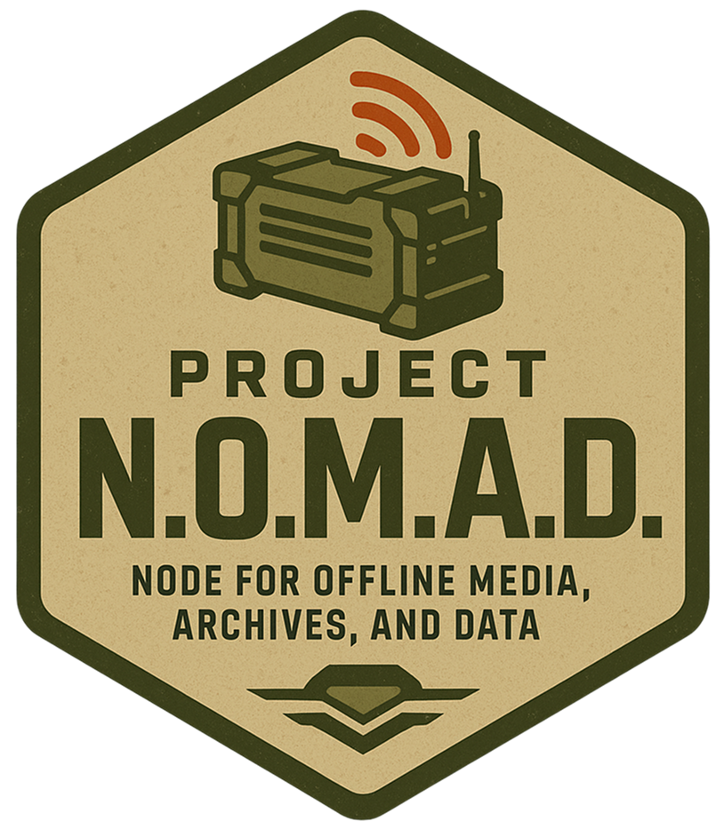

<div align="center">


# Project N.O.M.A.D. v4.1.0
### The Most Complete Offline Survival Command Center Available

**Free. Open Source. No Internet Required After Setup.**

Cross-platform — runs natively on Windows, Linux, and macOS. No Docker, no WSL, no VMs. 8 managed services, 467 API routes, 76 database tables, situation-aware AI with persistent memory and action execution, Zambretti offline weather prediction, full inventory management with barcode scanning, 42 interactive calculators, wiki-linked notes, media library with resume playback, and a fully customizable dark dashboard with 4 themes and night vision mode.

[](https://github.com/SysAdminDoc/project-nomad-desktop/releases/latest)
[](https://www.projectnomad.us)
[](https://discord.com/invite/crosstalksolutions)

</div>

---

> Competitors charge $280+ for a USB stick with curated content (Prepper Disk, Prep Drive). N.O.M.A.D. does everything they do and 10x more — for free. Offline weather forecasting, 42 interactive calculators, 56 reference cards, 21 decision guides, 17 emergency procedures, 15 checklist templates, 4 training scenarios, NukeMap v3.2.0, medical module with TCCC/triage and vital signs trending, food production with companion planting and pest guide, community intelligence network, power management, DTMF tone generator, NATO phonetic trainer, wiki-linked notes with templates, media library with resume playback, AI document intelligence with SITREP generation, built-in BitTorrent client, 210 survival channels, and a 38-section user guide.

**[Download Portable .exe](https://github.com/SysAdminDoc/project-nomad-desktop/releases/latest/download/ProjectNOMAD.exe)** — single file, no install needed, run from anywhere (USB, desktop, etc.)

**[Download Installer](https://github.com/SysAdminDoc/project-nomad-desktop/releases/latest/download/ProjectNOMAD-Setup.exe)** — installs to Program Files with Start Menu shortcut and desktop icon

---

## What Makes This Different

### Intelligence & Awareness
- **Zambretti Offline Weather Prediction** — Pure barometric pressure-based forecasting that works without any internet. Pressure history graph, trend analysis, and auto-generated weather alerts when storms approach.
- **Proactive + Predictive Alerts** — Background engine monitors burn rates, expiring items, pressure drops, and incident clusters every 5 minutes. Alerts fire for rapid pressure drops (>4 hPa = storm warning), extreme temps, and inventory depletion.
- **Situation-Aware AI with Memory** — The AI knows your actual inventory, burn rates, incidents, contacts, weather, power, patients, and garden data. Persistent memory remembers your location, group size, and ongoing situations. AI can execute actions directly ("Add 50 gallons of water to inventory").
- **AI SITREP Generator** — One-click military-format situation report compiled from 24h of activity, inventory changes, incidents, weather, power, and medical data.

### Preparedness & Inventory
- **Advanced Inventory System** — Supply tracking with barcode/QR scanning, lot number tracking, check-in/check-out ("who has the generator?"), photo attachments, daily burn rate projections, expiration alerts, auto-generated shopping lists, location tracking, and 5 quick-entry templates (155 items).
- **Interactive Decision Guides** — 21 step-by-step branching guides with 300+ decision nodes covering water, wounds, fire, shelter, radio, food, triage, and 14 more topics. Works fully offline without AI.
- **Medical Module** — Patient profiles with vital signs trending charts (HR, BP, SpO2, temp over time), wound documentation with photo capture, 26-pair drug interaction checker, expiring medication tracker, TCCC MARCH protocol wizard, START triage board, SBAR handoff reports, and printable care cards.
- **Training Scenarios** — 4 multi-phase survival simulations with AI-generated complications based on your real inventory. Scored after-action reviews track improvement.

### Knowledge & Notes
- **Wiki-Linked Notes** — Obsidian-style `[[Note Title]]` bidirectional linking with backlink panel, tag-based filtering, 6 built-in templates (SITREP, Incident Report, Patrol Log, Comms Log, Meeting Notes, Daily Journal), file attachments, and markdown preview.
- **Media Library with Resume** — Video, audio, and book library with resume playback ("Continue Watching"), playlist creation, metadata editor, and 210 curated survival channels.
- **Knowledge Base Workspaces** — Create named knowledge bases ("Medical KB", "Water KB") with folder-watch auto-indexing. Model cards show parameter count, quantization, and RAM requirements.

### Communications & Radio
- **DTMF Tone Generator** — Full 16-key keypad generating accurate dual-tone frequencies via WebAudio. Sequence input for automated playback.
- **NATO Phonetic Alphabet Trainer** — Interactive quiz mode with scoring, plus complete A-Z + 0-9 reference grid.
- **Antenna Length Calculator** — Half-wave dipole, quarter-wave vertical, full-wave loop, and J-pole calculations from any frequency.
- **Mesh Radio** — Meshtastic bridge for LoRa mesh messaging, comms status board aggregating all channels (LAN/mesh/HF/VHF/federation).
- **LAN Chat with Channels** — Local network messaging with named channels (General, Security, Medical, Logistics), presence indicators showing online nodes, and file transfer support.

### Garden & Food Production
- **Companion Planting Guide** — 20 plant pair relationships (companion + antagonist) with searchable reference.
- **Pest & Disease Guide** — 10 common garden pest reference cards with symptoms, treatment, and prevention.
- **Seed Inventory** — Track seed stock with viability percentages, days to maturity, and planting season.
- **Planting Calendar** — Zone-based planting/harvest date calculations.
- **Harvest Yield Tracking** — Log actual vs expected yield with caloric output analysis.

### Maps & Navigation
- **Offline Maps** — MapLibre GL + PMTiles with 50+ tile sources, downloadable per-region.
- **3 Map Styles** — Default, dark tactical, and satellite — cycle with one click.
- **Distance Measurement** — Click-to-measure Haversine distance calculator on map.
- **Print Map** — Export current map view as PNG and print via browser.
- **GPX Import/Export** — Load GPS tracks onto the map, export waypoints as GPX files.

### Benchmarking & Diagnostics
- **AI Inference Benchmark** — Measure tokens/second for any installed model.
- **Storage I/O Benchmark** — 32MB read/write test to verify USB drive speed.
- **Network Throughput** — TCP socket test measuring LAN speed in Mbps.
- **Historical Comparison** — Chart benchmark scores over time to detect hardware degradation.

### Customization & UX
- **Full Customization Panel** — Right-side slide-out panel to toggle any sidebar tab on/off, show/hide any home page section, switch themes, change UI scale, and pick dashboard modes. All preferences persist in localStorage.
- **Bento Grid Dashboard** — Asymmetric two-column layout: Situation Dashboard + Needs Overview side-by-side, services full-width, Field Documents + Activity Log side-by-side.
- **Persistent AI Copilot Dock** — Fixed bottom bar available on every tab. Ask questions, get answers, dismiss when done. Ctrl+/ focuses instantly.
- **4 Themes** — Desert (default light), Night Ops (tactical dark), Cyber (blue dark), Red Light (night vision preserving scotopic vision).
- **Status Strip Pills** — Colored pill indicators with live status dots for services, supplies, contacts, alerts, and situation.

---

## 11 Main Tabs

| Tab | What It Does |
|-----|-------------|
| **Home** | Bento grid dashboard with live widgets, needs overview, services, field documents, activity log |
| **AI Chat** | Local AI with 19 presets, model cards, situation awareness, persistent memory, SITREP generation, action execution, document intelligence, RAG pipeline |
| **Library** | ZIM content library (100+ datasets, 14 categories) with Wikipedia tier selector, content updates, bulk downloads |
| **Maps** | Offline maps with 50+ sources, 3 styles, waypoints, zones, measurement, GPX, print, bookmarks |
| **Notes** | Wiki-linked markdown notes with tags, backlinks, templates, attachments, daily journal, live preview |
| **Media** | 210 survival channels, video/audio/book library, resume playback, playlists, metadata editor, BitTorrent |
| **Tools** | NukeMap, Meshtastic, DTMF generator, phonetic trainer, guided drills, immersive training scenarios |
| **Preparedness** | 25 sub-tabs: inventory, medical, garden, power, security, radio, calculators, guides, and more |
| **Readiness** | Readiness score dashboard with category breakdown, improvement actions, coverage overview |
| **Benchmark** | CPU, memory, disk, AI inference, storage I/O, network throughput scoring with trend history |
| **Settings** | System monitoring, AI models, task scheduler, serial ports, system health, CSV import, sync, preferences |

## 8 Managed Services

| Service | What It Does | Port |
|---------|-------------|------|
| **Ollama** | Local AI chat — Qwen3, Gemma 3, MedGemma, DeepSeek-R1 + GPU auto-detection | 11434 |
| **Kiwix** | Offline Wikipedia, medical references, survival guides, Army field manuals | 8888 |
| **CyberChef** | Encryption, encoding, hashing, 400+ data operations by GCHQ | 8889 |
| **FlatNotes** | Markdown note-taking with tags, search, and flat-file storage | 8890 |
| **Kolibri** | Khan Academy courses, textbooks, progress tracking | 8300 |
| **Qdrant** | Vector database for document upload and semantic search (RAG) | 6333 |
| **Stirling PDF** | Merge, split, compress, convert, OCR — 50+ PDF tools | 8443 |
| **BitTorrent** | Built-in libtorrent client with 152 curated survival torrent collections | in-process |

## 25 Preparedness Sub-Tabs

| Sub-Tab | Features |
|---------|---------|
| **Inventory** | Supply tracking with barcode/QR, lot numbers, check-in/out, photos, burn rates, expiration alerts, auto-shopping list, 5 templates (155 items), CSV import/export, location tracking |
| **Contacts** | Emergency directory with callsigns, roles, skills, blood types, rally points, medical notes |
| **Checklists** | 15 templates (72hr kit, bug-out bag, vehicle kit, winter storm, CBRN shelter, infant kit, and more) |
| **Medical** | Patient profiles, vital signs trending charts, wound photos, drug interactions, expiring med tracker, TCCC/MARCH wizard, triage board, SBAR handoffs, printable care cards |
| **Incidents** | Chronological event timeline with severity levels, category filtering, cluster detection |
| **Family Plan** | FEMA-style emergency plan: meeting locations, evacuation routes, household members, insurance/utility info |
| **Security** | IP camera feeds (MJPEG/snapshot/HLS), access logging, security dashboard with threat level |
| **Power** | Device registry, power logging, autonomy projection dashboard, sensor time-series charts |
| **Garden** | Plots, companion planting guide (20 pairs), pest/disease guide (10 entries), seed inventory, harvest log, livestock, zone lookup, planting calendar, yield analysis, preservation log |
| **Weather** | Zambretti offline prediction, barometric pressure history graph, trend analysis, weather-triggered alerts, wind chill/heat index calculator |
| **Guides** | 21 interactive decision trees with 300+ nodes. "Ask AI" at any step. Printable procedure cards. |
| **Calculators** | 42 calculators: water, food, solar, ballistics, fallout, canning, IV drip, dead reckoning, antenna length, and more |
| **Procedures** | 17 emergency procedures with printable wallet cards |
| **Radio** | Frequency table (FRS/GMRS/MURS/CB/HAM/NOAA), DTMF tone generator, phonetic alphabet trainer, antenna calculator, comms status board, radio profiles |
| **Quick Ref** | 56+ reference cards: NATO alphabet, Morse code, triage, companion planting, wild edibles, TCCC/MARCH, and more |
| **Signals** | Ground-to-air emergency signals, sound signal patterns, smoke signal guide |
| **Command Post** | SITREP generator (AI-powered), message cipher, threat assessment matrix, ICS 309/214 forms, emergency broadcast |
| **Journal** | Daily journal entries with mood tracking, tags, chronological timeline, full export |
| **Secure Vault** | AES-256-GCM encrypted storage for passwords, coordinates, sensitive documents |
| **Skills** | 60 survival skills across 10 categories with proficiency tracking |
| **Ammo** | Ammunition inventory with caliber-grouped summary cards |
| **Community** | Community resource registry with trust levels and skills/equipment tracking |
| **Radiation** | Nuclear dose rate log with cumulative rem tracking |
| **Fuel** | Fuel storage tracking with type-grouped totals and expiry monitoring |
| **Equipment** | Equipment maintenance log with service scheduling |

## 9 Printable Field Documents

| Document | Description |
|----------|-------------|
| **Operations Binder** | Complete multi-page reference: TOC, contacts, frequencies, medical cards, inventory, checklists, waypoints, procedures, family plan |
| **Wallet Cards** | 5 lamination-ready cards (3.375"×2.125"): ICE, blood type, medications, rally points, frequency quick-ref |
| **SOI** | Signal Operating Instructions: frequency assignments, call sign matrix, radio profiles, net schedule |
| **Frequency Card** | Standard emergency frequencies with team contacts |
| **Medical Cards** | Per-patient vital signs, medications, conditions |
| **Bug-Out Checklist** | Grab-and-go packing list with rally points |
| **Inventory Report** | Full supply list with quantities, locations, expiration dates |
| **Contact Directory** | Complete personnel directory |
| **Emergency Sheet** | One-page critical data aggregate |

---

## Quick Start

### Option 1: Portable (no install)
1. Download **[ProjectNOMAD.exe](https://github.com/SysAdminDoc/project-nomad-desktop/releases/latest/download/ProjectNOMAD.exe)**
2. Double-click to run — works from USB drives, desktops, anywhere
3. Follow the setup wizard (choose Essential, Standard, Maximum, or Custom)

### Option 2: Installer
1. Download **[ProjectNOMAD-Setup.exe](https://github.com/SysAdminDoc/project-nomad-desktop/releases/latest/download/ProjectNOMAD-Setup.exe)**
2. Run installer — adds Start Menu shortcut and desktop icon
3. Launch from Start Menu

### Option 3: Run from source (any platform)
```bash
git clone https://github.com/SysAdminDoc/project-nomad-desktop.git
cd project-nomad-desktop
python nomad.py
```
Dependencies auto-install on first run.

### Option 4: Build your own binary
```bash
pip install pyinstaller
pyinstaller build.spec
# Output: dist/ProjectNOMAD (or ProjectNOMAD.exe on Windows)
```

---

## Requirements

- **Windows**: Windows 10/11 + WebView2 Runtime (included with Windows 11)
- **Linux**: Python 3.10+, `python3-gi gir1.2-webkit2-4.1` (for pywebview GTK backend)
- **macOS**: Python 3.10+ (uses native WebKit via Cocoa)
- Python 3.10+ bundled in portable exe, needed only for running from source

---

## Architecture

| Component | Technology |
|-----------|-----------|
| Window | pywebview (WebView2 on Windows, WebKit on macOS, GTK on Linux) |
| Backend | Flask — 467 API routes |
| Database | SQLite (76 tables, WAL mode, auto-backups, 111 performance indexes) |
| AI | Ollama native + GPU auto-config (NVIDIA/AMD/Intel) |
| Alerts | Background engine (5-min cycle) + weather-triggered + predictive trend analysis |
| Weather | Zambretti barometric algorithm (pure offline) + pressure graphing |
| Scheduler | Recurring tasks with auto-recurrence (daily/weekly/monthly) |
| Encryption | AES-256-GCM via Web Crypto API |
| Maps | MapLibre GL JS + PMTiles (bundled locally) + 50+ sources + 3 styles |
| NukeMap | Leaflet 1.9.4 (bundled) — 18 JS modules |
| Notes | Wiki-links + backlinks + tags + templates + attachments |
| Media | Resume playback + playlists + yt-dlp + FFmpeg + libtorrent |
| Radio | DTMF WebAudio + phonetic trainer + antenna calculator + freq database |
| Federation | UDP discovery + HTTP sync + community readiness + skill matching + alert relay |
| Medical | Vitals trending + wound photos + drug interactions + TCCC + triage + SBAR |
| Garden | Companion planting (20 pairs) + pest guide (10) + seed inventory + yield analysis |
| Hardware | pyserial bridge for USB sensors, time-series charting |
| Mesh | Meshtastic LoRa bridge, comms status board |
| Print | 9 field documents (operations binder, wallet cards, SOI, and more) |
| Benchmarks | AI inference + storage I/O + network throughput + historical comparison |
| LAN | Chat channels + presence indicators + heartbeat discovery |
| Tray | pystray (background operation) |
| PWA | Service worker + manifest.json for mobile "Add to Home Screen" |
| Build | PyInstaller (single binary) + Inno Setup (Windows installer) |
| Customization | Full UI panel (theme, scale, mode, sidebar, sections) + localStorage persistence |

---

## Data Location

Data stored in platform-appropriate location:
- **Windows**: `%APPDATA%\ProjectNOMAD\`
- **Linux**: `~/.local/share/ProjectNOMAD/` (or `$XDG_DATA_HOME`)
- **macOS**: `~/Library/Application Support/ProjectNOMAD/`

```
nomad.db                # SQLite (76 tables, WAL mode)
logs/                   # Application logs (rotating, 5MB max)
backups/                # Automatic DB backups (5 rotation)
services/               # Service binaries + data
  ollama/models/        # AI models
  kiwix/library/        # ZIM content files
  flatnotes/            # FlatNotes venv + data
maps/                   # Downloaded map data
videos/                 # Offline video library
audio/                  # Audio files
books/                  # EPUB/PDF library
library/                # PDF/ePub documents
kb_uploads/             # Knowledge base documents
torrents/               # BitTorrent downloads
photos/                 # Inventory + wound photos
attachments/            # Note attachments
```

---

## Original vs Desktop Edition

This project is based on [Project N.O.M.A.D.](https://github.com/Crosstalk-Solutions/project-nomad) by Crosstalk Solutions. The original is a Docker-based Linux application; this is a cross-platform desktop edition that extends it significantly.

### What's the Same
Both share the same core philosophy: an offline-first, self-contained knowledge and AI platform. Both include Ollama, Kiwix, Kolibri, ProtoMaps, CyberChef, and Qdrant. The visual style and "Command Center" branding are consistent.

### What the Desktop Edition Adds

Everything from the original plus: 25 preparedness sub-tabs, proactive + predictive + weather-triggered alerts, Zambretti offline weather prediction with pressure graphing, AI SITREP generation + action execution + persistent memory + model cards, task scheduler, 21 decision guides, medical module (TCCC/triage/SBAR/vital signs trending/drug interactions/expiring meds), 4 training scenarios, food production (companion planting, pest guide, seed inventory, yield analysis), power management with sensor charts, security cameras, multi-node federation with community readiness + skill matching + alert relay, NukeMap v3.2.0, media library (210 channels, resume playback, playlists, 152 torrents), DTMF tone generator, NATO phonetic trainer, antenna calculator, wiki-linked notes with templates + backlinks + attachments, serial hardware bridge, mesh radio, 9 printable field documents, CSV import wizard, 5 inventory templates (155 items), inventory barcode/QR + lot tracking + check-in/out + photos + auto-shopping list, map measurement + print + style switcher + GPX, AI inference + storage + network benchmarks, LAN chat channels + presence, QR code generation, database health tools, undo system, full UI customization panel, bento grid dashboard, PWA with offline caching, 4 themes, 42 calculators, 56 reference cards, 17 emergency procedures, encrypted vault, and a 38-section user guide.

### Platform Differences
| | Original | Desktop Edition |
|---|----------|-----------------|
| Installation | `curl` + bash script, requires Docker | Download .exe / .AppImage / .dmg and run |
| Runtime | Docker containers on Linux | Native processes (Windows/Linux/macOS) |
| Database | MySQL | SQLite (zero config, 76 tables) |
| Frontend | React + Inertia.js | Single-file HTML/CSS/JS |
| Backend | AdonisJS (Node.js) | Flask (Python, 467 routes) |
| Build | Docker image | PyInstaller + Inno Setup |

---

## What's New in v4.1.0

- **Bento grid home layout** with sidebar group labels and status strip pills
- **Persistent AI copilot dock** (bottom bar, available on all tabs)
- **Full UI customization panel** (theme, scale, mode, sidebar toggles, section toggles)
- **Zambretti offline weather prediction** with pressure history graph and weather-triggered alerts
- **Inventory upgrades** — barcode/QR, lot tracking, check-in/out, photo attachments, auto-shopping list
- **Wiki-linked notes** with backlinks, 6 templates, file attachments, daily journal
- **Media resume playback** with Continue Watching, playlists, and metadata editor
- **Vital signs trending charts** and expiring medication tracker
- **DTMF tone generator**, NATO phonetic alphabet trainer, antenna length calculator
- **Companion planting guide** (20 pairs), pest/disease guide (10 entries), seed inventory
- **Map measurement tool**, print-to-PDF, style switcher, GPX import/export
- **AI inference, storage I/O, and network throughput benchmarks**
- **LAN chat channels** with presence indicators
- **Model cards** showing parameter count, quantization, and RAM estimates
- **KB workspaces** for scoped document collections
- **Readiness tab** — score moved off home page (no red "F" on first launch)
- **Service card status variants** — visual running/stopped/not-installed states
- **Need coverage progress bars** on Preparedness By Need cards
- **135+ code quality fixes** — XSS patches, font consistency, CSS deduplication, accessibility

---

## Credits

Based on [Project N.O.M.A.D.](https://github.com/Crosstalk-Solutions/project-nomad) by Crosstalk Solutions. Desktop edition by [SysAdminDoc](https://github.com/SysAdminDoc).
